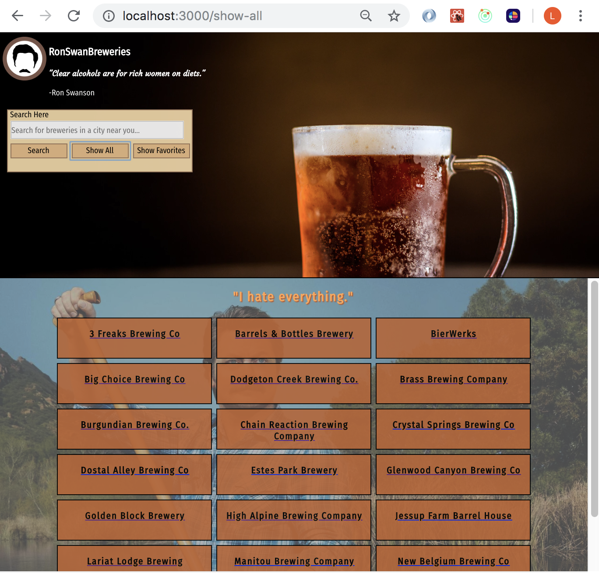
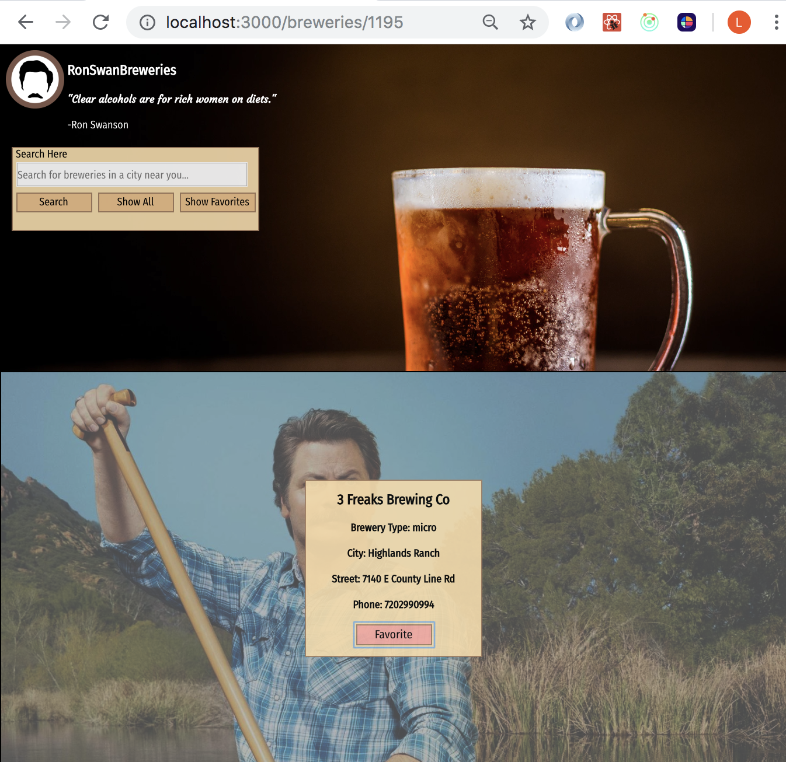

### Description
This project is crafted to allow a user to search, view, and favorite Colorado breweries brought in via API, while giving a whimsical feature of randomized Ron Swanson quotes.

### Installation

To install, first clone down this repo `git clone https://github.com/lboyer4/ron-swan-brews.git` 

next, run `npm install`

view app in browser with `npm start`

### Screenshots 

Image of desktop version showall cards feature

Image of desktop version of show specific card feature

### Wireframe

image of the UI wireframe

### Learning Goals

The main goal of this project was to successfully implement a variety of technologies including: React, Redux, Router, and Asynchronous javaScript. 

My personal learning goal is to improve my testing skills in all of these areas. 
